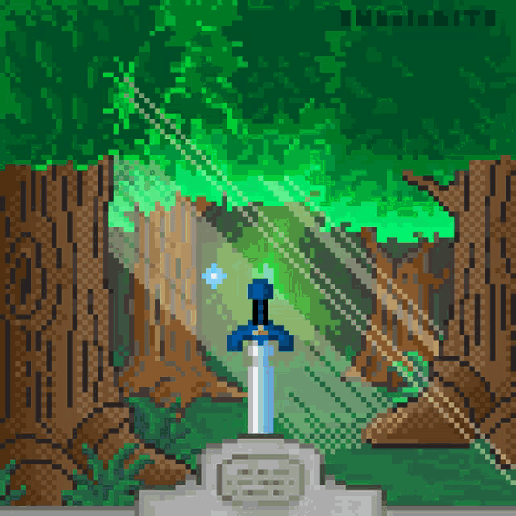

<!-- Header GIF -->
<table align = "center">
  <tr>
  <td valign = "middle">
    
  </td>
  
  <td valign = "middle" align = "center">
  
  # You've Found a Treasure!
  
  </td>
  </tr>
</table>

***

<!-- Profile README description -->
### Hello there! I'm Talon Booth, and here's a little bit about me:

- 🏡 I grew up in southwest Virginia
- 🦃 I graduated from [Virginia Tech](https://www.vt.edu/) (2024) - BS in Chemical Engineering
- 🏛️ I'm currently a 2nd year MS student at the [Univeristy of Virginia](https://www.virginia.edu/)
- 🗡️ I'm a huge fan of The Legend of Zelda series!
<!-- - 🎓 I graduated from the [Univeristy of Virginia](https://www.virginia.edu/) (2026) - MS in Materials Science and Engineering -->

  

<!-- Software languages and tools -->
### Top Languages/Tools

  

<!-- Interests and passions -->
### My Interests/Passions
- 🖥️ I'm eager to learn more about command-line interface tools and how to develop them
- 📈 I'm looking to build upon my machine learning skills and study interpretable machine learning
- 🌐 I'm learning about frontend development for web applications in using HTML, CSS and JavaScript
- ⚛ I'm currently building upon a Python library I made to help material scientists with data extraction

<!-- Contact me -->
### Connect with Me!

  

  

***

<!-- GitHub Stats -->

  
  

<!-- Hyperlinks -->

